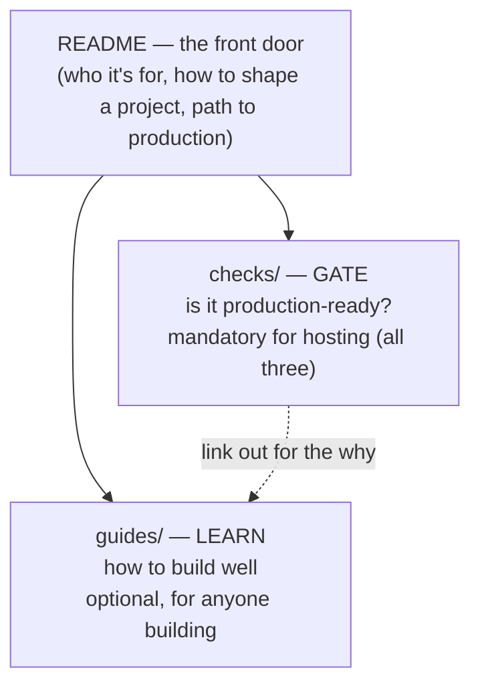

# Babson AI Build Guide

How to build an AI project that Babson will host for you.

Build whatever you want, however you want. This guide only covers one thing: getting a project onto Babson's infrastructure so other people can use it. You build it; we host, secure, and run it. The requirements below exist so we can actually do that.

---

## Contents

1. [Who this is for](#1-who-this-is-for)
2. [Scope](#2-scope)
3. [Demo vs. product](#3-demo-vs-product)
4. [Before you build](#4-before-you-build)
5. [Five questions to answer first](#5-five-questions)
6. [The toolkit](#6-the-toolkit)
7. [What makes a project hostable](#7-hostable)
8. [Data](#8-data)
9. [Responsible AI](#9-responsible-ai)
10. [How this repo is organized](#10-repo-contents)
11. [Path to production](#11-path-to-production)
12. [For AI Fellows](#12-for-fellows)

---

## 1. Who this is for

Grant recipients, AI Fellows, and students who've outgrown no-code tools and want to build something custom that Babson will host. You don't need to be an expert — you need an idea and the willingness to build it so it can leave your laptop.

If you're already a confident builder: skim sections 3–5, then work from 6–9 and lean on the [guides](./guides) for depth.

---

## 2. Scope

This guide is the path to *Babson-hosted* production. It is not a rulebook for what you're allowed to build. On your own machine, with your own tools and keys, build anything. The requirements here only apply when you want *us* to host it.

---

## 3. Demo vs. product

A demo works once, for you, while you're watching. A product works every time, for everyone, unattended — without breaking, leaking data, or running up a surprise bill.

The demo is the easy part. Reliability, security, hosting, and cost are the rest of the work, and it's where most projects stall. We handle that part for you, as long as the project is built in a shape we can pick up. That's what the rest of this guide defines.

---

## 4. Before you build

Check whether you need to build at all. Two no-code tools cover a lot:

- **Microsoft Copilot Studio** — drag-and-drop agents, Babson login, no code.
- **BabsonChat** — chat with models, build lightweight assistants.

If one of these does the job, use it and skip the rest. This guide is for when you've outgrown them.

---

## 5. Five questions to answer first

Answer these in a sentence each and you understand your project's shape. They're also what we'll ask when you submit it.

1. **How does it get used?** Interactive (someone clicks/chats), scheduled, event-triggered, or batch?
2. **What data does it touch?** Use fake data while you build — see [section 8](#8-data).
3. **What does it need to remember?** Nothing, a little, or a lot? Start at the low end.
4. **Should it be automated at all — and where does a human stay in the loop?** Some decisions an AI can make on its own; consequential ones (sending something for a person, changing a record, anything someone would want to review) should be proposed by the app and approved by a person. Decide this before you build.
5. **Who would own it in production?** Not you — a **durable owner**: a staff or faculty sponsor who stays accountable for it after you graduate or move on. For a throwaway experiment, nobody. For anything the campus would rely on, there has to be a named sponsor. See [`/guides/lifecycle-and-ownership.md`](./guides/lifecycle-and-ownership.md).

Deeper version: [`/guides/solution-architecture.md`](./guides/solution-architecture.md).

---

## 6. The toolkit

A short, approved stack — Python or JS/TS, FastAPI or Next.js + Vercel AI SDK, Claude or OpenAI SDK, LangGraph for agents, pandas, SQLite, Git. It's deliberately small so builds host cleanly. Want something not listed? Check with us first.

The full stack and the reasoning: [`/guides/toolkit.md`](./guides/toolkit.md).

> Just need to move fast and browse tools? The hackathon quick-start — [github.com/BabsonAI/hack_quickstart](https://github.com/BabsonAI/hack_quickstart) — ships a demo in an afternoon. This guide is the next step: the subset that becomes a hosted product.

---

## 7. What makes a project hostable

The short version — hit these and we can run it:

- **It's in a GitHub repo.** That's how it reaches us.
- **No secrets in the code.** Keys, tokens, and passwords stay out of your files and commits — we wire in credentials at hosting time.
- **It runs on fake data.** So we can run and review it without exposing anything real.
- **Someone can run it without you.** A short `README.md` — what it does, how to run it, what's mocked — is enough.

The [Production Compliance Check](./checks/production-compliance-check.md) is the full verification of this.

---

## 8. Data

Build on synthetic (fake) data — it's the faster path, not just the safer one: no privacy strings, no access requests, no review delays. Real or live data is possible but gated (a campus use case, a durable owner, and AI-team sign-off); the bar is who owns the responsibility, not how good the idea is. On your own machine, connect whatever you want — this only applies to what we host.

Synthetic vs. real, storage, and persistence in full: [`/guides/data-guidance.md`](./guides/data-guidance.md).

---

## 9. Responsible AI

Because this is a university and you may be building for other students, faculty, or staff, a few things matter more — student data (FERPA), telling people they're using AI, academic integrity, bias, and accessibility. You don't have to be an expert; you do have to know where the lines are and flag anything near them. Most of it is awareness-tier: you surface it, the AI team and Babson own enforcement.

What each line means and how to stay on the right side of it: [`/guides/responsible-ai.md`](./guides/responsible-ai.md).

---

## 10. How this repo is organized

Two layers, for two moments — **guides teach, checks verify:**

**[`/guides`](./guides) — learn how to build well.** Optional, for anyone building; read what's useful. Toolkit, data, AI patterns, solution architecture, responsible AI, model access, lifecycle & ownership, and submitting for production.

**[`/checks`](./checks) — prove it's production-ready.** If you're submitting for Babson hosting, **all three are mandatory**: Production Compliance (is it hostable), AI Patterns Review (is the AI sound), and Submission Readiness (are you ready).

Plus, **coming soon:** [`/prompt-templates`](./prompt-templates) (scaffolds), [`/examples`](./examples) (real builds), and [`/diagrams`](./diagrams) (architecture).

Rule of thumb: a concept is explained once in a guide; the checks and this README link to it rather than repeating it.

---

## 11. Path to production

1. **Build** — your toolkit, your keys, fake data, in a GitHub repo.
2. **Prove** it works — including the required evals (functional tests + golden prompt tests).
3. **Self-check** — run the three checks in [`/checks`](./checks). For production, all three are mandatory.
4. **Submit** to the AI team ([`/guides/submitting-for-production.md`](./guides/submitting-for-production.md)).
5. **Review** — built in a hostable shape, with a durable owner behind it? It's a go.
6. **Ship** — we package it for the cloud, give it a real address, wire in production keys, secure it, and keep it online.

The infrastructure is on us. You bring a working idea worth shipping. What happens *after* it ships — maintenance, updates, who owns it when you graduate — is covered in [`/guides/lifecycle-and-ownership.md`](./guides/lifecycle-and-ownership.md).

---

## 12. For AI Fellows

The repo improves the more it's used:

- **Add an example** to [`/examples`](./examples) with a short README.
- **Add a prompt scaffold** to [`/prompt-templates`](./prompt-templates) for a shape that keeps recurring.
- **Add a diagram** of a common architecture.
- **Fix a guide** in [`/guides`](./guides) if something tripped you up.

Open a PR. Keep contributions build-first, hostable, and useful.
